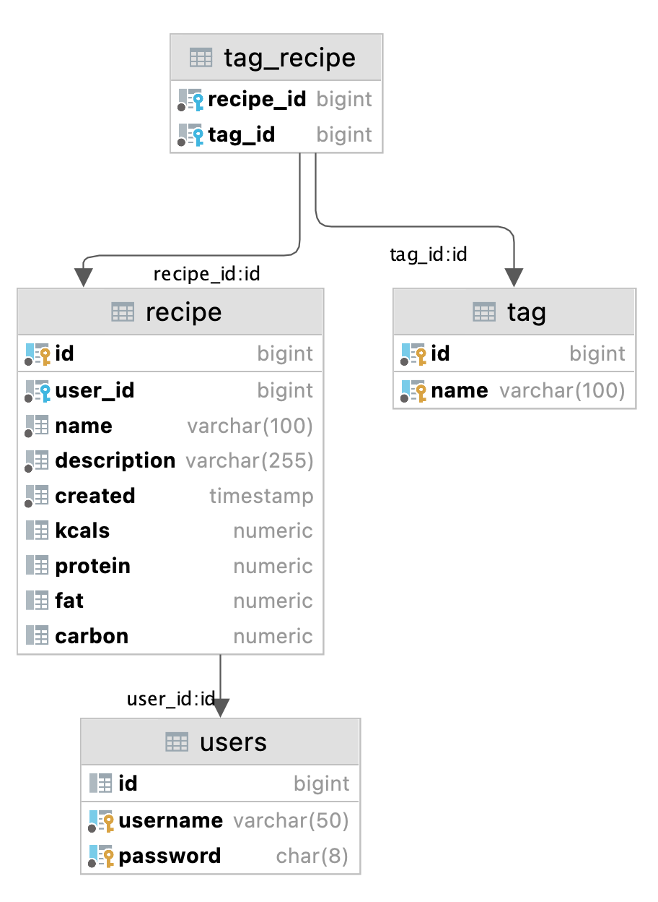

# easy-cook
Проект c CRUD функционалом, выполненный для отработки знаний по изученным технологиям. 👨‍🍳

### open-api
[link](open-api.json)

### Технологии:
1. Java
2. Spring Framework
   * Boot
   * Web
   * Data JPA
   * Security
3. Hibernate
4. Liquibase
5. Maven
6. Docker Compose
7. PostgreSQL
8. Redis (для кэширования)
9. Lombok

### Особенности реализации:
1. JWT-токены для аутентификации при использования API.
2. Запуск сервиса и инфраструктуры в Docker Compose.
3. Шифрование паролей пользователей.
4. Кэширование пользовательских данных.
5. Валидация DTO с помощью аннотаций.
6. Для инициализации структуры БД используется Liquibase.

## Структура Базы Данных

